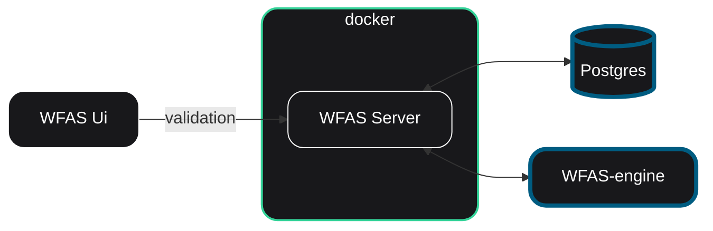

[](https://github.com/soamn/wfas)
[](https://github.com/soamn/wfas-engine)
[](https://github.com/soamn/wfas-ui)


# WFAS Server

### Workflow Automation System Server

WFAS Server is application server for WFAS, Handles, Authentication, Validation, workflow validation, workflow cycle check, handles wfas-ui requests, handles user sessions, interacts with wfas-engine for execution and syncing, updates wfas-ui with workflow data, Interacts with providers to setup webhooks and encrypts data and safely sends data to wfas-engine.

---

## ⚙️ Server Overview


---

## Local Setup

To Run You would need wfas-engine and wfas-ui setup as well and docker installed.

```
cp .env.example .env

docker build -t wfas-server .

docker run --network="host" --env-file .env wfas-server

```
